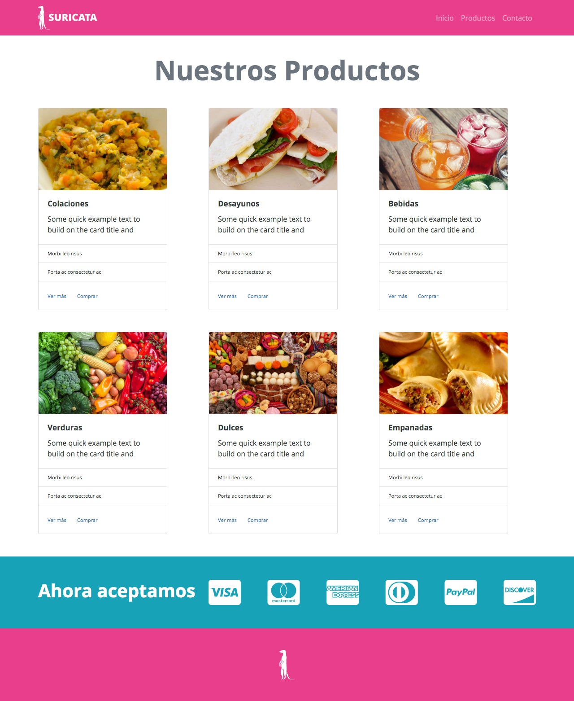

# Desafío - Suricata
> Aplicando todos los conceptos y herramientas aprendidas en los videos sección Online
Mejorando la experiencia y diseño de los sitios web con Bootstrap, vamos a construir la
página de "Suricata".



## Requisitos

- Debes construir un layout responsivo, considerando Mobile First.
- Realizar la construcción del HTML y CSS siguiendo la maqueta proporcionada.
- Debes utilizar Bootstrap.

Tipografías:
- Open Sans. 

font-weight:
- Open Sans Regular (400).
- Open Sans Bold (700).

Colores:
- #212529
- #fff o var(--white);
- #e83e8c o var(--pink);
- #17a2b8 o var(--info);

Íconos (Font Awesome):
- cc-visa
- cc-mastercard
- cc-amex
- cc-diners-club
- cc-paypal
- cc-discover


```sh
/assets/img para las imágenes
/assets/css/style.css para el archivo CSS
/index.html
```
